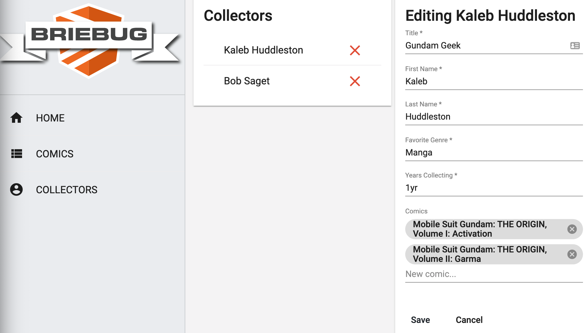

# Comic Collector Dashboard

This project was generated using [Nx](https://nx.dev).



## App Description

This is the 6th of 8 Accelerated Angular LevelUp Applications.
It aims to show a more complex feature set/data model for a fully reactive, unit tested, well architected Angular application.

Specifically, this dashboard app features CRUD functionality on two entities - Collectors...

```json
"collectors": [
    {
      "id": "56789f40-b0fb-4aa6-8e88-376b4edfm8he",
      "title": "Gundam Geek",
      "firstName": "Kaleb",
      "lastName": "Huddleston",
      "favoriteGenre": "Manga",
      "timeCollecting": "1yr",
      "comics": [
        {
          "id": "56789f40-b0fb-4aa6-4e88-376b4edfm8he",
          "title": "Mobile Suit Gundam: THE ORIGIN, Volume I: Activation",
          "description": "The beginning of it all...",
          "genre": "manga",
          "collectorId": "56789f40-b0fb-4aa6-8e88-376b4edfm8he"
        }
      ]
    }
]
```

and Comics...

```json
"comics": [
    {
      "id": "56789f40-b0fb-4aa6-4e88-376b4edfm8he",
      "title": "Mobile Suit Gundam: THE ORIGIN, Volume I: Activation",
      "description": "The beginning of it all...",
      "genre": "manga",
      "collectorId": "56789f40-b0fb-4aa6-8e88-376b4edfm8he"
    },
    {
      "id": "567898j0-b0fb-4aa6-4e88-376b4e0lk8he",
      "title": "Mobile Suit Gundam: THE ORIGIN, Volume II: Garma",
      "description": "Things are heating up...",
      "genre": "manga",
      "collectorId": "56789f40-b0fb-4aa6-8e88-376b4edfm8he"
    },
]
```

Catalog your extensive comic collection.

## See It Live

[Visit Comic Collector Dashboard](https://levelup-angular-06-collectors.surge.sh/)

## Getting Started

Run `npm install`.

## Development server

Run `npm run serve:all` for a dev server and to run the json-server api. Navigate to http://localhost:4200/. The app will automatically reload if you change any of the source files.

## Build

Run `ng build dashboard` to build the project. The build artifacts will be stored in the `dist/` directory. Use the `--prod` flag for a production build.

## Understand your workspace

Run `nx dep-graph` to see a diagram of the dependencies of your projects.
